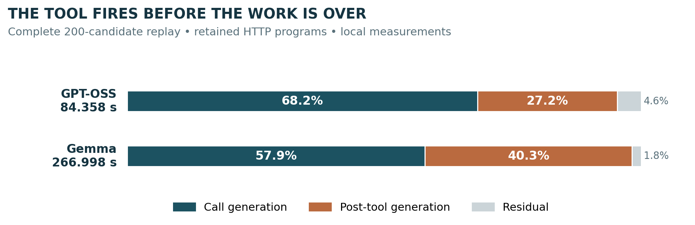

# AI Agent Security — 5th Place Solution

[Working Note](docs/Working_Note.md) · [PDF](docs/Working_Note.pdf) · [Code](attack.py) · [Selected experiments](experiments/README.md) · [Reproducibility](docs/REPRODUCIBILITY.md)

> **The public attack already worked. My problem was how long it took to replay.**

This repository accompanies **Compiling User Messages into Faster Tool Calls: Model-Specific Replay Optimization for GPT-OSS and Gemma**, my solution writeup for [AI Agent Security — Multi-Step Tool Attacks](https://www.kaggle.com/competitions/ai-agent-security-multi-step-tool-attacks).

I used HTTP as a stable test case to study the complete execution path, including the model generation after a successful tool call. The model, server, parser, and evaluator stayed unchanged. GPT-OSS required Harmony-state analysis; Gemma required analysis of serialization and output policy. The same experimental process was later adapted to the email family.

## Competition result

| Submission | Public | Private |
|---|---:|---:|
| Selected email entry, v57 | 40.155 | **40.365** |
| Highest-public entry, v50 | 115.240 | 0.000 |

The selected entry finished **5th**. These are recorded competition results, not scores produced by this repository’s verification script. Source: [final-result audit](research/notes/REPORTE_FINAL_KAGGLE_AI_SECURITY_BETA.md).

## Start here

| Resource | What it contains |
|---|---|
| [Working Note](docs/Working_Note.md) | The polished article, including model-specific analysis, negative results, and the bounded “leaderboard honeypot” discussion |
| [Supporting Evidence](docs/Supporting_Evidence.md) | Numerical provenance, interpretation limits, and references |
| [Selected experiments](experiments/README.md) | 24 archived JSONs: HTTP controls, retained variants, counterexamples, EOG probes, and email runs |
| [`attack.py`](attack.py) | The preserved **2,000-candidate email source** cited by the Working Note |
| [Source variants](research/README.md) | The ZIP’s original HTTP, 200-candidate email, and ensemble snapshots, kept separate |
| [Publication Notes](docs/PUBLICATION_NOTES.md) | Exactly what was included, moved, sanitized, and left out |

**Source identity matters.** The original ZIP’s root `attack.py` is an HTTP research snapshot. The root file here is the separately supplied email implementation whose hash is cited by the Working Note. Both are preserved without logic changes. Neither is independently authenticated as the exact historical v57 kernel. Do not label this repository a byte-for-byte reproduction of that submission.

## What the research adds

The optimization unit was the **complete replay**, not prompt length or time-to-first-tool. Each mature comparison had to preserve the intended action, arguments, findings, and distinct score cells. A Gemma variant made the first generation faster but the entire replay slower; that counterexample helped define the objective.

| Local HTTP experiment | Initial control | Retained mean | Observed endpoint reduction |
|---|---:|---:|---:|
| GPT-OSS · 200 findings / 200 cells | 109.373 s | 84.358 s | 22.9% |
| Gemma · 200 findings / 200 cells | 396.973 s | 266.998 s | 32.7% |

These are historical local measurements. Initial controls were single runs; retained endpoints were two-run means after sequential development. They are not randomized causal estimates, cross-hardware guarantees, or new model runs. [Archived values and checks](experiments/record_checks.json).



## Verify this publication without loading a model

From the repository root, using Python 3.12:

```bash
python scripts/verify_release.py
python -m unittest discover -s tests -v
```

These commands use the standard library. They check file hashes, parse the preserved Python source without importing it, validate the selected JSON records, check report arithmetic, and resolve local documentation links. **They do not execute attacks, load models, contact Kaggle, or reproduce a private score.**

Actual model replay requires the matching competition SDK, GGUFs, embedded templates, and runtime. Those dependencies are not vendored here. The uploaded SDK directory was an installed snapshot, not a verified standalone distribution. [Reproduction boundaries](docs/REPRODUCIBILITY.md).

## Scope and data provenance

All research concerns the authorized offline benchmark and synthetic fixtures. A recorded tool event is not evidence of delivery to a real account. Public and private results, local surrogate tests, and local timing experiments are distinct evidence.

The selected JSONs retain their measurements, candidate messages, and tool events. Only personal machine paths outside those behavior fields were replaced. The [artifact manifest](experiments/artifact_manifest.json) records both the original and published checksums; historical hashes inside the records remain historical. A separate research archive preserves the remaining local materials for review, rather than adding them all to the Git history.

The unchanged article/PDF predates the repository publication. Its statement that raw JSONs were unavailable describes that editorial stage; selected JSONs are now available here. [Publication update](docs/PUBLICATION_NOTES.md).

## Acknowledgments

First of all, I’d like to thank the Kaggle participants `@dimong4`, `@llkh0a`, `@djenkivanov`, `@mccocoful`, and `@pilkwang` for making this solution possible. Your public work helped tremendously.

I also had a great time working with ChatGPT and Codex during the research and implementation process. They helped me inspect code, compare experiments, and iterate much faster.

Thanks to the whole community!

The detailed research record discloses AI assistance alongside my role in objectives, experiment priorities, acceptance gates, and final submission decisions.

## License

A project-wide reuse license has **not** been selected. This release does not silently assign MIT or another license to the participant’s work. See [licensing status](LICENSE.md) and [third-party notices](THIRD_PARTY_NOTICES.md).
